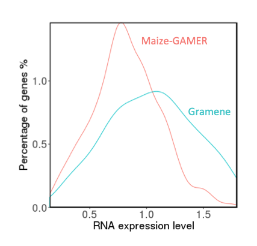

# C-REx: A shiny web application to compare RNA expression

C-REx implements a novel statistical method (He et al., 2017) that was designed to assess significance of differences in RNA expression levels among specified groups of genes. This Shiny web application called C-REx (Comparison of RNA Expression) enables researchers to readily test hypotheses about whether specific gene groups share expression profiles and whether those profiles differ from those of other groups of genes. 

## Installation 
### option one use c-rex on our lab server
http://c-rex.dill-picl.org/

### option two install rocker-c-rex
**Those source code are prepared to build a docker image of shiny web application called C-REx**

Installation as follow:

_Step 1_:
download this repository to your local machine

_Step 2_:
install and start docker 
(if you need more help about docker installation, please refer to docker website: https://docs.docker.com/install/)

_Step 3_:
unzip rocker-c-rex.zip file and cd to local dir and on command line type to build your local docker image: 
>docker build --tag c_rex .

_Step 4_:
run docker image by command line: 
>docker run c_rex

(Note: The default port set as 3838)
Finally the new shiny application website is available at local: 0.0.0.0:3838/app_c_rex

## Quick start 
To use C-REx, first choose to carry out a ‘within sample’ or a ‘between sample’ comparison. Next, upload or select expression input file(s) from the examples provided (see format details in the next section). For within sample comparisons, a single file is uploaded whereas between-sample comparisons require two input files. 

## Input data format

Comma separated values (.csv), not zipped.

3 columns: 
1. Gene ID
2. Gene Expression value (TPM/FPKM)
3. Gene group identifier

* Example:

AC147602.5_FG004, 188, non TF genes

AC148152.3_FG005, 8, non TF genes

AC148152.3_FG008, 93, non TF genes

AC148167.6_FG001, 96, non TF genes

AC149475.2_FG002, 17, non TF genes

AC149475.2_FG003, 37, non TF genes

### Formatting Caveats
•	Expression values can be an average from many biological replicates

•	Do not include commas inside gene group names, a bad example would be 'Human,embryo genes'. Instead, this title should be something like this: ‘Human embryo genes’.

•	Each annotation requires a single line. If there are, e.g., two annotations for the same gene, the same gene gets two lines, like this:

o	AC149818.2_FG001, 188, non TF genes

o	AC149818.2_FG001, 188, housekeeping genes

•	If you are comparing the same group of genes under two conditions, genes with TPM or FPKM values smaller than 1 in both conditions should be filtered out. We consider such data unreliable because it is hard to tell whether the corresponding reads were from signal or noise.

•	Use the exact label 'housekeeping genes' in the third column to annotate housekeeping genes. Some bad examples would be Housekeeping Genes, housekeeping, HOUSEKEEPING, etc.

## Example usage cases
### Assessing variability between replicates

Gene expression values are often inconsistent between biological or technical replicates (Conesa et al., 2016). C-REx can be used to carry out Student’s t-test between biological replicates to determine whether sample-based variability is so great that downstream analyses are not appropriate. 

#### Materials and Methods
RNA-seq data were collected from maize under control (non-stress) conditions (Makarevitch et al., 2015). To illustrate our method, a group of genes were selected according to annotation to GO:0006950 (response to stress) by Gramene version 37 (Tello-Ruiz et al., 2016) or maize-GAMER (Wimalanathan et al., 2018). Maize housekeeping genes were designated by Lin et al., 2014). This results in 4 files, “Gramene-non-stress-biological-replicate-1.csv”, “Gramene-non-stress-biological-replicate-2.csv”, “maize-GAMER-non-stress-biological-replicate-1.csv”, and “maize-GAMER-non-stress-biological-replicate-2.csv” (available online under the C-REx “How to” tab). Each file has 3 columns: gene ID, expression value (FPKM/TPM), and gene group name (GO:0006950 used to annotate gene group in this example). Files marked by the same annotation method are compared between biological replicates.  For instance, “Gramene-non-stress-biological-replicate-1.csv”, and “Gramene-non-stress-biological-replicate-2.csv” were uploaded to C-REx as a “Between sample comparison” session and were processed by the automatic computational pipeline (for mathematics details please refer to He et al., 2018). By choosing GO:0006950 (genes annotated by Gramene as GO:0006950) under “Choose Gene Groups” on control panel and clicking on the Student’s t-test tab on result panel, the Student’s t-test p-value is returned for the Gramene dataset. The same process applies for the cognate maize-GAMER analysis.  

#### Results
Student t-test p-values indicate that there are no significant expression differences between biological replicates under non-stressed growing conditions. This is true using the group of genes tagged by this GO term for both Gramene and maize-GAMER (Table S1). This outcome indicates that the gene groups specified in both GO annotations datasets behave consistently between replicates and findings of gene expression differences by C-REx are not likely due to sampling effects (i.e., results are not artefactual). 

### Influence of gene grouping methods on observed expression differences

Not all GO datasets assign the same group of genes to a given GO term. Here, we show how differences between GO annotations can influence the outcomes of gene expression analyses for both GO enrichment and for analysis using C-REx.

#### Materials and Methods

RNA-seq data were collected under UV treatment from maize (Makarevitch et al., 2015). Expression values of genes annotated to GO:0006950 (response to stress) by Gramene version 37 (Tello-Ruiz et al., 2016) (N=129) or maize-GAMER (Wimalanathan et al., 2018) (N=971) along with housekeeping genes were extracted from samples. Biological replicates were averaged into one single gene expression value for each gene. This results in 2 files, “Gramene-UV-stress.csv” and “maize-GAMER-UV-stress.csv” (available online under C-REx “How to” tab). Each file has 3 columns: gene ID, expression value (FPKM/TPM), and gene group name (GO:0006950 was used to annotate gene group in this example). These datasets were uploaded as “Gramene-UV-stress.csv” and “maize-GAMER-UV-stress.csv” to C-REx and a “Between sample comparison” was carried out. Under “Choose Gene Groups” GO:0006950 (genes annotated by Gramene or maize-GAMER as GO:0006950) was selected on the control panel. 

#### Results

The Gramene dataset has a flatter distribution (the curve is wider) than that of maize-GAMER (Fig S1),  and the Gramene dataset has a larger standard deviation with fewer genes annotated as compared with the maize-GAMER dataset (Table S2). F-test analysis of the difference between standard deviations (maize-GAMER vs Gramene) yields a p-value <0.001, indicating that there is a significant difference in standard deviation between the Gramene and maize-GAMER datasets. This smaller standard deviation could be interpreted many ways, but one thing is clear: the set of genes annotated as GO:0006950 in the GAMER dataset responds to stress in a more coordinated way than those tagged with this term in the Gramene dataset, thus demonstrating that methods for defining gene groups are highly influential for gene expression analysis.

Figure 1. Influence of various methods of GO annotations on gene expression distribution density plots.  RNA expression levels of response related gene groups (genes marked as GO:0006950) normalized by housekeeping genes plotted by percentage. Note that each gene expression value was averaged across biological replicates before grouping. Gramene (N-129) shown in blue; maize-GAMER (N=971) shown in pink.

### Detecting small but significant expression differences
GO enrichment analysis of RNA-seq data depends on defining individual DEG. Here we show that C-REx can recover groups identified by GO enrichment as well as those that are not identifiable by GO enrichment. 

#### Materials and Methods
RNA-seq data collected were under control (non-stress) and UV treatment for maize as described by Makarevitch et al., 2015. For this analysis, genes were counted as “expressed” if their where TPM>1. Gramene version 37 (Tello-Ruiz et al., 2016) or maize-GAMER (Wimalanathan et al., 2018) were extracted from each sample for non-stress and UV stress conditions. GO enrichment analysis was conducted using Fisher’s exact test for up-regulated DEG gene sets (log2(UV/control)>1) annotated by maize-GAMER or Gramene. We further limited the results to groups where the GO term sets contained at least 15 genes for downstream normality check and Student t-test. This resulted in 4 files, “maize-GAMER-non-stress.csv”, “maize-GAMER-UV-stress.csv”, “Gramene-non-stress.csv”, “Gramene-UV-stress.csv” (available online under C-REx “How to” section). Each file has 3 columns, gene ID, expression value (FPKM/TPM), and gene group name (defined by GO terms assigned by Gramene or maize-GAMER).  By choosing GO:0006950 (genes annotated by maize-GAMER as GO:0006950) under “Choose Gene Groups” on the control panel and selecting the “Student t-test” tab on the result panel, the p-value for Student’s t-test is returned for maize-GAMER. The same process applies to Gramene. Bonferroni multiple test correction was applied to raw p-values from GO enrichment and C-REx.

#### Results
As shown in Table S3, both C-REx and GO enrichment recover significant results for GO:0009644 (response to high light intensity) using the maize-GAMER gene set (see Supplemental excel file Full List of GO Enrichment Analysis and C-REx Results). The Gramene gene set annotations for GO:0009644 do not yield a significant p-value for GO enrichment nor for the C-REx analysis. This suggests that 1) GO annotation methods and datasets that define gene groups influence the interpretation of RNA-seq data; and 2) C-REx could detect strong signals on the same gene set marked as significant by GO enrichment analysis. To further assess the ability of C-REx, GO:0006950 (response to stress) are compared between C-REx and GO enrichment. P-values of GO enrichment on neither Gramene nor maize-GAMER gene sets are significant after Bonferroni multiple test correction. On the other hand, C-REx detects a significant shift between UV and non-stress gene groups, which yields a p-value <0.0001 for the Gramene set, but not the maize-GAMER set (Table S4). One thing to notice, although in section 3.2 C-REx detects larger variance in Gramene dataset than maize-GAMER, the p-value from C-REx on Gramene dataset is still very significant compared with GO enrichment analysis. The goal of GO enrichment test is to identify gene sets that are enriched in the list of differentially expressed genes, and that certainly dependent on the method for differential expression analysis. The C-REx test here aims to identify gene sets whose expression profile changes across condition. In the case of GO:0006950 set, although GO enrichment test does not provide significant result, our test still shows this gene set may respond to the stress condition. This suggests that C-REx could be used as a supplementary approach alongside GO enrichment analysis to assess changes in gene expression. 

## References
Conesa,A. et al. (2016) A survey of best practices for RNA-seq data analysis. Genome Biol., 17.

He, M. et al. (2018) A hypothesis-driven approach to assessing significance of differences in RNA expression levels among specific groups of genes. Curr. Plant Biol.

Lin, F. et al. (2014) Genome-wide identification of housekeeping genes in maize. Plant Mol. Biol., 86, 543–554.

Makarevitch, I. et al. (2015) Transposable Elements Contribute to Activation of Maize Genes in Response to Abiotic Stress. PLoS Genet., 11.

Tello-Ruiz, M.K. et al. (2016) Gramene 2016: Comparative plant genomics and pathway resources. Nucleic Acids Res., 44, D1133–D1140.

Wimalanathan, K. et al. (2018) Maize GO Annotation-Methods, Evaluation, and Review (maize-GAMER). Plant Direct, 2, e00052.

