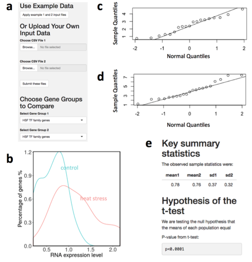

# Summary
Most gene expression analysis methods discover groups of genes that are co-expressed, rather than testing whether a specified gene group behaves in a concerted manner. We implemented a novel statistical method designed to assess significance of differences in RNA expression levels among specified groups of genes. Our Shiny web application C-REx (Comparison of RNA Expression) enables researchers to readily test hypotheses about whether specific gene groups share expression profiles and whether those profiles differ from those of other groups of genes. We implemented data transformation, a normality visualizer, and both parametric and non-parametric tests for determining whether gene groups are functioning in concert or in contrast both within and between conditions. Here, we demonstrate that the C-REx application recovers well-known biological phenomena (e.g., response to heat stress).

# Example usage case: expression differences for specified gene groups in heat stress
To use C-REx, first choose to carry out a ‘within sample’ or a ‘between sample’ comparison. Next, upload or select expression input file(s) from the examples provided (see format details in Supplementary Materials). For within sample comparisons, a single file is uploaded whereas be-tween-sample comparisons require two input files. In Figure 1, panel a, two preloaded example datasets from maize (heat stressed and non-stressed; Makarevitch et al., 2015) are analyzed via the between-sample comparison (described in detail by He et al., 2017). Expression input files specify gene sets by name, including a set of designated housekeep-ing genes, which are used for sample normalization. Once input files are specified, dropdowns entitled “Choose Gene Groups to Compare” are populated by the gene group names specified in the input files. 
In panel b, differences in expression of heat shock factor transcrip-tion factor (HSF TF) genes between stress and non-stress conditions are shown. The curves are calculated as follows. The C-REx tool generates log-transformed gene expression values, normalizes gene expression values based on housekeeping gene expression means, and graphs the normalized and transformed expression value distributions. As shown in panels c and d, a Q-Q plot is created to allow the user to assess whether the normality assumption has been met for each generated distribution (therefore indicating that parametric statistics can be used). If the data satisfies the normality requirement, the user clicks the “Student’s t-test” tab to generate panel e, a “Key summary statistics” report including mean, standard deviation, and a p-value. For cases where the normality assumption is not met, the Wilcoxon signed-rank test is implemented and available. The analysis in Figure 1 indicates that the HSF TF gene group is significantly up-regulated in maize under heat stress. Mathematical details of the method are outlined in (He et al., 2017).

**Figure 1 :** C-REx analysis between heat stress and non-stress conditions for maize HSF TF. **(a)** Click “Apply example 1 and 2 input files” and choose “HSF TF family genes” for each sample. Click the “Gene distribution” tab to produce **(b)** the expression level density plot (non-stress-green, heat stress-pink). Inspect whether the transformed data satisfy the normality requirement by selecting the “normality test” tab. Heat stress shown in **(c)** and non-stress shown in **(d)** with each log-transformed expression value shown as a black circle. Diagonal indicates perfect concordance between the normal distribution and transformed expression values. Click “Student’s t-test” tab for **(e)** a statistical summary with means, standard deviation, and p-values.

# Acknowledgements
We thank Carla Mann and Ian Braun for helpful discussion and suggestions as well as Scott Zarecor and Darwin Campbell for technical assistance.
# Funding
This work has been supported by the Iowa State University Plant Sciences Institute Faculty Scholars program.

_Conflict of Interest:_ none declared.

# References
