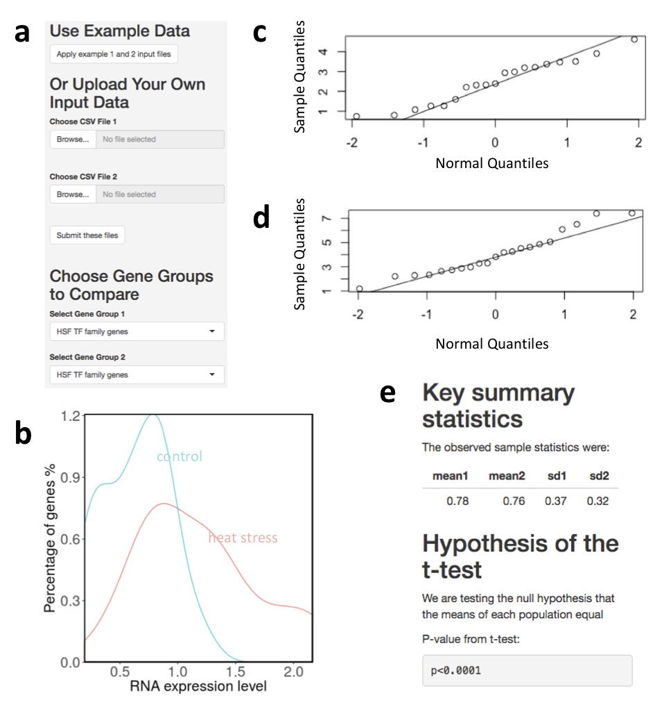

# Summary
Most gene expression analysis methods discover groups of genes that are co-expressed, rather than testing whether a specified gene group behaves in a concerted manner. We implemented a novel statistical method designed to assess significance of differences in RNA expression levels among specified groups of genes. Our Shiny web application C-REx (Comparison of RNA Expression) enables researchers to readily test hypotheses about whether specific gene groups share expression profiles and whether those profiles differ from those of other groups of genes. We implemented data transformation, a normality visualizer, and both parametric and non-parametric tests for determining whether gene groups are functioning in concert or in contrast both within and between conditions. Here, we demonstrate that the C-REx application recovers well-known biological phenomena (e.g., response to heat stress) and show how gene group membership differences can affect results of gene expression analysis (based on grouping by Gene Ontology functional annotations). Finally, we demonstrate that the method implemented via C-REx could recover responsive gene set that GO enrichment omitted when fold change differences are small. 

**Figure 1 :** 

# References
